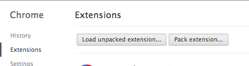

# Debugging Wizkers

Depending on the run mode of Wizkers, several options are available to you:

## Chrome app

The best way to debug Mouse Wizkers is to use the Developer tools in Chrome. You can simply load the Wizkers chrome app manually by going to the “Extensions” menu in Chrome, and use “Load Unpacked Extension…” and make it point to the the “server” directory.



This will start Mouse Wizkers with all developer tools enabled (which is not the case in the Chrome Store version where those are disabled).

## Server mode

In server mode, Wizkers uses the Node.js “debug” facility: simply define a “DEBUG” variable to enable debug output. All modules in Wizkers already define a unique debug name, so you get fairly fine grained output. You can try a “DEBUG=* node server.js” to get an idea of the maximum level of debug output you can get.

## Android application

You can also use Chrome to debug Wizkers running as an Android application: you need to have the Android SDK installed on your computer, and your test device connected through USB using `adb`.

### Network debugging of Android

Since Wizkers lets you use the USB port of your Android device to connect to various kinds of instruments, you will often end up in situatino where you cannot do USB debugging. This is not a problem, since adb can also work on the network. You still need to link your Android device to the adb server on your computer through USB once:

```bash
$ adb tcpip 5555
```

Then you can disconnect the Android device from USB, and connect through the Wifi network:

```bash
$ adb connect <device-ip-address>
```

The Chrome Webview contained in Wizkers will then start showing up on Chrome's `chrome://inspect` screen.