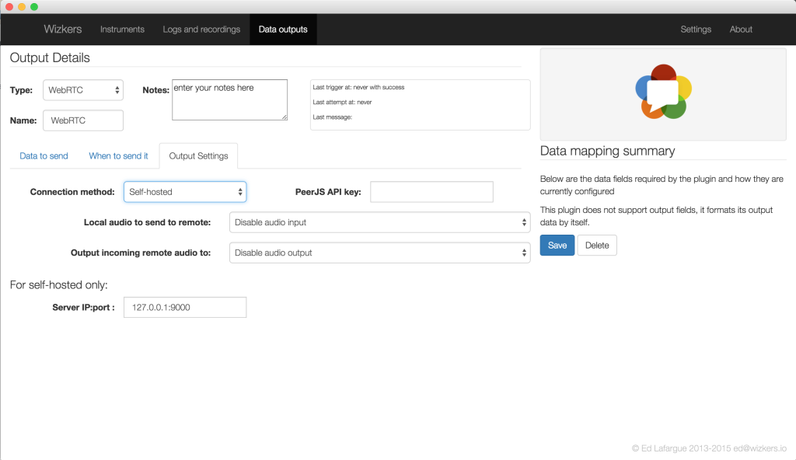

#WebRTC Output

This output plugin forwards all the data coming from the instrument over a WebRTC data channel. If can also send bidirectional audio to a remote end. The data channel is also bidirectional.

You can use this plugin in two different ways: display instrument data and do remote control from remote web page, or connect to an instrument from Wizkers running on a remote computer.

As of 0.9.19, you can use this Output for the Elecraft KX3 for remote operations: configure a “Elecraft KX3 Radio” instrument on a local Wizkers instance, then add the WebRTC output. Then, on another computer, create a “Remote KX3” instrument, which will let you connect to your KX3 remotely, including full duplex audio.

## Interfacing a web page with the WebRTC Output

The WebRTC output uses the PeerJS library to implement a simple wrapper around WebRTC. This makes it easy to display instrument data on a remote web page.

TODO: create a detailed guide on how to implement an example web page once all the code is on github.