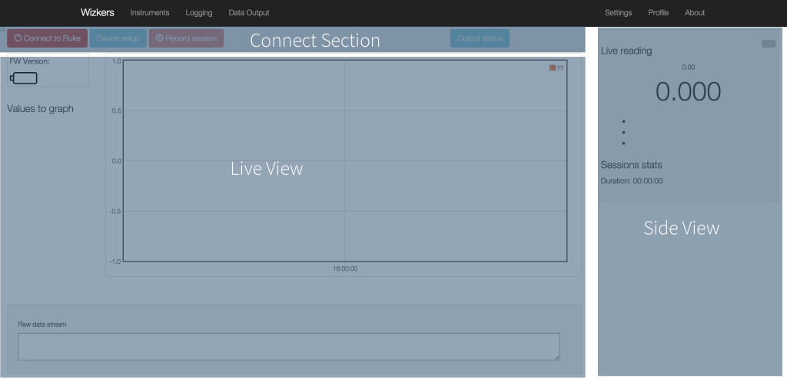
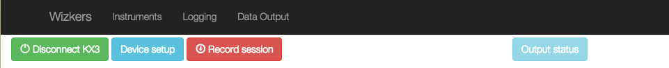
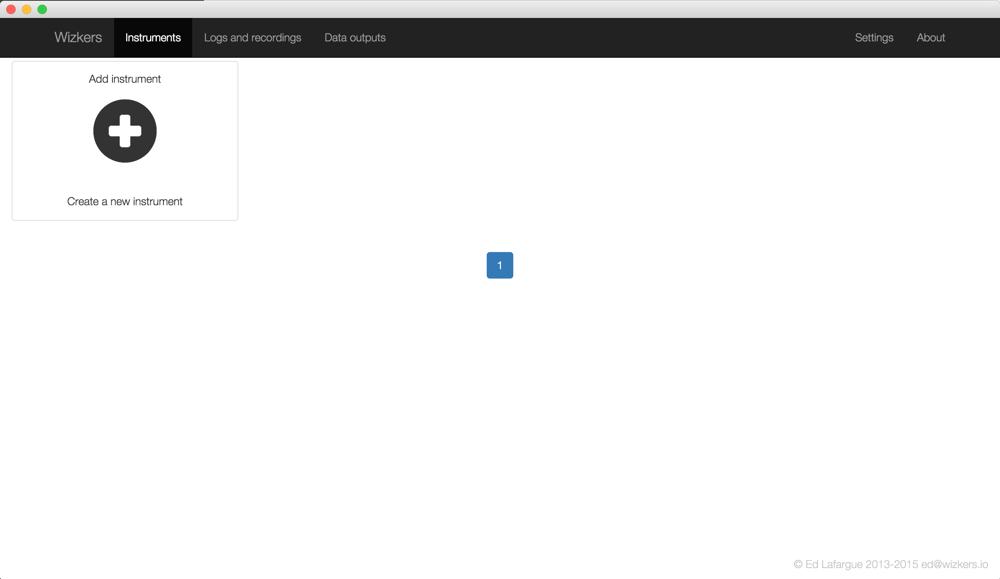
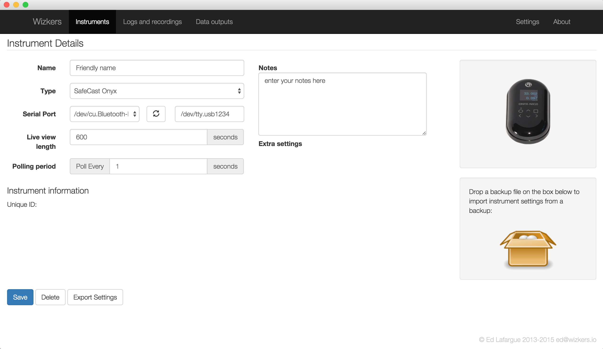
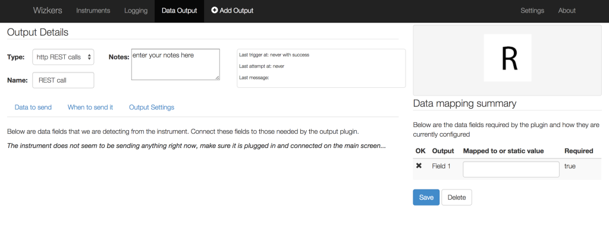

# Wizkers User documentation

Welcome to the user documentation of Wizkers. This section will help you make the most of the various capabilities of Wizkers.

# Home screen

The home screen contains three main zones:

* Connect/Setup/Record zone
* Main view / Live view
* Side view

The first time you start Wizkers, you will need to create a new instrument, as described in the next section.

## Connecting instruments

The top buttons are pretty much self-explanatory: the “Connect” button opens the connection to the instrument. The “Device Setup” button will only be enabled if the device supports a Setup screen (not all do). Last, the “Record Session” button lets you do a live recording of the data coming in from the device. You can view the logs that are saved there in the “Logs and recordings” screen.

# Configuring instruments

All instrument configuration is done on the “Instruments” screen. The first time you start the application, no instruments will be present. To create a new instrument, click on “Add Instrument” card:

After pressing “Add Instrument“, you will be presented with a blank configuration screen, as shown below. Some instruments display extra settings, but the following is always present:

First of all, give a “Friendly Name” to your instrument, and select the correct instrument type.

Depending on the instrument type, the "port" section will be different. Port can be:

* A serial port
* A bluetooth device
* A network address
* An API Key

Refer to the documentation of each instrument for more details on how to configure those fields.

The _Live view length_ option defines the time length of the the home screen live view - by defaults, Wizkers displays the last five minutes of data, or last 500 points.

_Polling period_ defines how often Wizkers requests information from the instrument. Some instruments will send data at their own rate, in which case this setting will be unused for that instrument.

# Logs and recordings

# Outputs

Output plugins are one of the great features of Wizkers: using those plugins, you can automatically send the data generated by your instruments to various backend services.

At the moment, Wizkers ships with four output plugins:

* [Generic REST output](out/rest.md)
* [Safecast output](out/safecase.md)
* HAM Radio [“rigctld” emulation plugin](out/rigctld.md), for remote control of radios.
* [WebRTC Output](out/webrtc.md)

## Creating and configuring an output

All output plugins share quite a few settings: selecting what fields should be sent to the output, how often and with what conditions:

When you create an output from the “Data Output” screen (option on the top menu bar), you will see the screen below:

Note: you should be connected to the current instrument before creating an output, because the output plugin detects the data sent by the instrument for creating its configuration.

You can select the output plugin, give it a name and write notes in the top part of the window.

The section on the right tells you when the plugin was last triggered with success, when it last attempted to send data, and what the last message from the backend was. Very useful for debugging.

Then the screen contains three tabs: “Data to send”, “When to send it”, “Output Settings”. Only the last one (“Output Settings”) is plugin-specific, the first two are identical for all output plugins.

## Data to send

Again, you need to be connected to your instrument in order to be able to do anything with this screen. If not, it only displays a help message encouraging you to do so.

